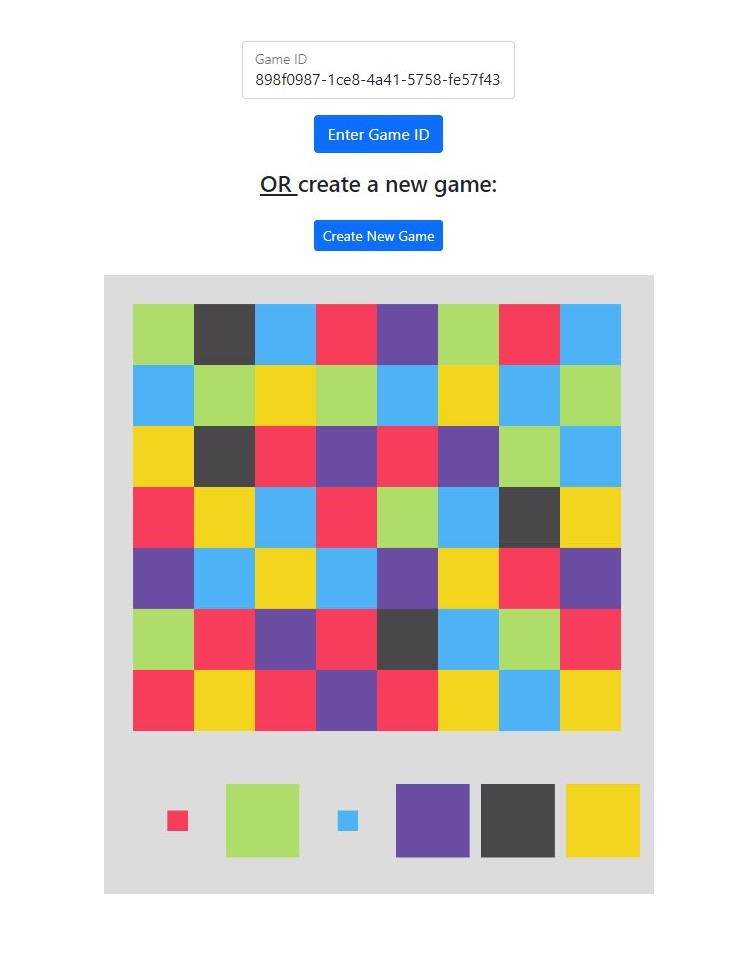

# filler - multiplayer

[PLAY IT HERE](https://filler.artomweb.com)

A multiplayer game based on GamePigeon's iMmessage game, filler

How to play:

- Start a game by clicking create a new game
- Give the game id, given above the game, to your friend, or enter it in the game id field in a new tab
- The player that entered the code always starts
- Each player starts in the bottom left
- Click on one of the colour options at the bottom of the game
- All the neighbouring squares of your square that are the colour of the option you selected will be claimed
- Players alternate turns
- The game ends when all squares have been claimed, the player with the most squares claimed wins!
